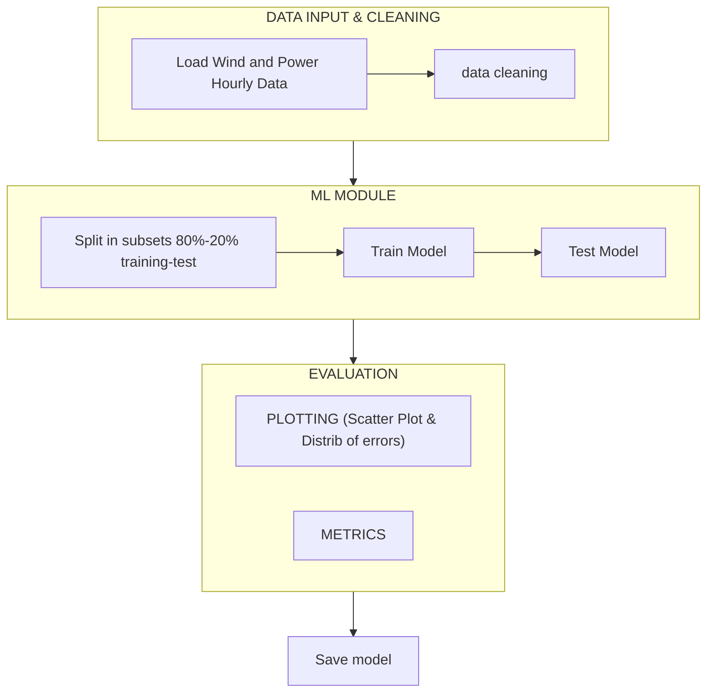

# Project03_46W38  
Wind power forecasting by machine learning  

## Input data
Dataset of **wind and power hourly data from 4 turbine sites**  
Time period: from 02.01.2017 to 31.12.2021  
Source: openly available dataset with open “CC0 1.0 Universal” license  

#### Available channels & format/unit
- Time — `YYYY-MM-DD HH:mm:ss`
- temperature_2m — °F @ 2 m
- relativehumidity_2m — %
- dewpoint_2m — °F
- windspeed_10m — m/s @ 10 m
- windspeed_100m — m/s @ 100 m
- winddirection_10m — deg (0–360) @ 10 m
- winddirection_100m — deg (0–360) @ 100 m
- windgusts_10m — m/s
- power — % of Prated (normalized)

---

## Sequence Overview

Steps:
1. **input data**
    - load_data
    - preprocess_data  
3. **machine learning module**
    - split in subsets — 80% train, 20% test
    - train model 
    - test model
6. **evaluation metrics**
   - plots
   - numerical metrics 
7. **save_model**

---

## Flowchart (Mermaid)


--- 

## Folder structure

```text
project03_46W38/
│
├── data/
│   ├── raw/                # original dataset
│   └── processed/          # cleaned data
│
├── scripts/
│   ├── main.py             # main script/user interface
│   ├── load_data.py        # reading datasets
│   ├── preprocess.py       # clean input data
│   ├── split_in_subsets.py # split in training and testing subsets
│   ├── train.py            # training 
│   ├── predict.py          # loading model and predicting
│   ├── evaluate.py         # charts and metrics to evaluate the model
│   ├── save_model.py       # save tested model
│
├── models/                 # saved trained models (.pkl)
|
└── README.md
```