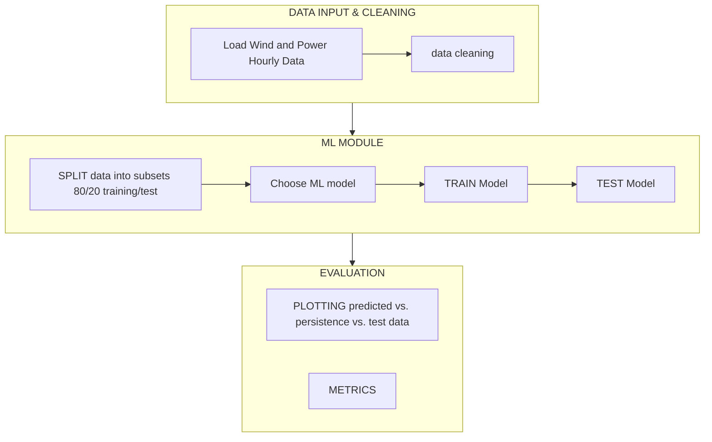

# Project03_46W38  
Wind power forecasting by machine learning  
This project is released under the MIT License.
Author: Stefano Dal Broi

## Input data
Dataset of **wind and power hourly data from 4 turbine sites**  
Time period: from 02.01.2017 to 31.12.2021  
Source: openly available dataset with open “CC0 1.0 Universal” license  

#### Available channels & format/unit
- Time — `YYYY-MM-DD HH:mm:ss`
- temperature_2m — °F @ 2 m
- relativehumidity_2m — %
- dewpoint_2m — °F
- windspeed_10m — m/s @ 10 m
- windspeed_100m — m/s @ 100 m
- winddirection_10m — deg (0–360) @ 10 m
- winddirection_100m — deg (0–360) @ 100 m
- windgusts_10m — m/s
- power — % of Prated (normalized)

---

## Sequence Overview

Steps:
1. **input data**
    - load data
    - preprocess_data 
    - plotting data  
3. **machine learning module**
    - split in subsets — 80% train, 20% test (consecutive timestamps)
    - train model 
    - test model (with metrics and plot)
6. **evaluation metrics**
   - plots
   - numerical metrics 
7. **save_model**

Some inputs from User are required (both command line and other GUIs):
    - site
    - time window for plotting
    - choice of ML model
    - setting model parameters
---

## Flowchart (Mermaid)

--- 

## Folder structure

project03_46W38/
│
├── inputs/
│   └── Location1.csv, etc.       # site datasets
├── outputs/                      # Generated plots (ignored except .gitkeep)
├── src/
│   └── project03/
│       ├── __init__.py
│       ├── wind_forecast.py      # main forecasting class
│       ├── utilities.py          # helpers: GUIs, metrics
│       └── keras_wrapper.py      # wrapper class for Keras model
├── examples/
│   └── main.py                   # example script to run the package
├── tests/
├── pyproject.toml
├── README.md
└── LICENSE

---

## Implemented Classes
### WindForecast 
src/project03/wind_forecast.py
Main class with wind power forecasting workflow, including:
    - load_data()       --> reads dataset of chosen site & converts timestamps & temperature units
    - plot_timeseries() --> plots time series of variables in time window selected by User
    - split()           --> splits into train/test subsets & applies scales inputs
    - train_ml_model()  --> asks User for model & parameters & train it
                        --> Support Vector Regression (SVR), Multi-layer Perceptro (MLPRegressor) & Dense Neural Network (Keras)
    - test_ml_model()   --> applies trained model to test data, then evaluate with metrics &    plotting predicted vs. persistence and test values

# KerasWrapper
src/project03/keras_wrapper.py
This class makes possible to use Keras neural networks so that they behave like scikit-learn models with .fit(x, y) and .predict(x).
Thanks to this, the ML train and test methods in WindForecast are the same for all models.

### Utility Functions
src/project03/utilities.py
    - ask_value(prompt, choices, default)   --> console-based site & model/parameter selection
    - choose_from_list(list)                --> Tkinter GUI list of input dataset varaibles for plotting
    - choose_time_window(start, end)        --> TkCalendar GUI for time window selection
    - prediction_metrics(y_true, y_pred, unit)  --> computes MSE, RMSE, MAE

## Installation Instructions
Install the package locally inside the project root:
pip install -e .
Run the example and follow the instructions:
python examples/main.py